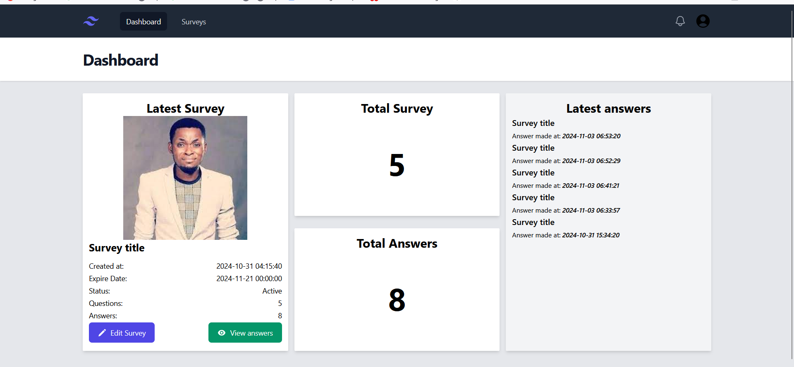

# Survey Application with Laravel 10 for api and reactjs for frontend 

## Features
  1. Create survey with unlimited custom questions 
  2. Login register and logout functionalities
  3. public the survey so that everyone can answer 
  4. overview of the created survey's questions and answers
## Installation 

1. **Clone the repo**
 ```bash 
 git clone https://github.com/kyawzinkoko-dev/laravel-react-survey
 ```
2. **Backend**
```
bash
cp .env.example .env
```
configure database username and password according to your machine
```bash 
php artisan migrate 
php artisan serve
```
3. **Frontend**
```bash
cd react 
npm install 
npm run dev
```
4. Navigate to ```localhost:3000 ```
